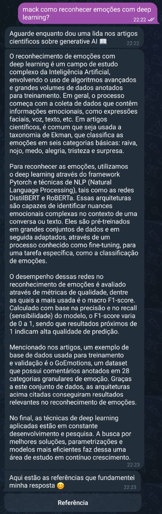
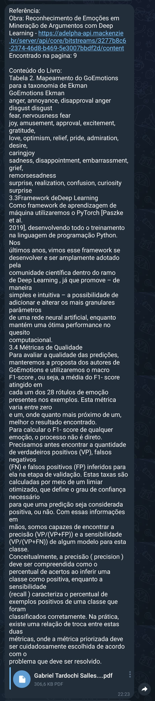

# Hackathon Accenture - Search GPT


> Calculadora de polinômios feito em C. Operações suportadas: resolver, somar, subtrair e multiplicar polinômios de até grau 10.

## 💻 Demonstração




## 💡 Tecnologia

- Python
- Langchain
- OpenAI (modelos [text-embedding-ada-002](https://platform.openai.com/docs/guides/embeddings/what-are-embeddings) e [gpt-4](https://platform.openai.com/docs/guides/gpt))
- PyPDF2
- tiktoken
- Python Dotenv

## 🚀 Execução do projeto

```bash
# Clone do repositório
$ git clone https://github.com/Richardsan1/hackathon-accenture.git

# Acessar o diretório do projeto
$ cd hackathon-accenture

# Instalação das dependências
$ pip install -r requirements.txt

# Execução do script Python
$ python search-gpt.py

# (Opcional) Abrir o arquivo 'search-gpt.ipynb' no Jupyter Notebook (ou derivados)
```

## 📫 Contribuição

Para contribuir com **hackathon-accenture**, siga estas etapas:

1. Bifurque este repositório.
2. Crie um branch: `git checkout -b <nome da funcionalidade>`.
3. Faça suas alterações e confirme-as: `git commit -m '<breve descrição sobre a funcionalidade>'`
4. Envie para o branch original: `git push origin <feature/funcionalidade>`
5. Crie a solicitação de pull.

Como alternativa, consulte a documentação do GitHub
em [como criar uma solicitação pull](https://help.github.com/en/github/collaborating-with-issues-and-pull-requests/creating-a-pull-request).

## 🤝 Colaboradores

Agradecemos às seguintes pessoas que contribuíram para este projeto:

<table>
  <tr>
    <td align="center">
      <a href="https://github.com/Richardsan1">
        <br>
        <sub>
          <b>Richardsan1</b>
        </sub>
      </a>
    </td>
    <td align="center">
      <a href="https://github.com/ImGabreuw">
        <br>
        <sub>
          <b>ImGabreuw</b>
        </sub>
      </a>
    </td>
    <td align="center">
      <a href="https://github.com/Joao-Bentivi">
        <br>
        <sub>
          <b>Joao-Bentivi</b>
        </sub>
      </a>
    </td>
    <td align="center">
      <a href="https://github.com/ViniSegatto">
        <br>
        <sub>
          <b>ViniSegatto</b>
        </sub>
      </a>
    </td>
  </tr>
</table>

[⬆ Voltar ao topo](#hackathon-accenture)<br>
